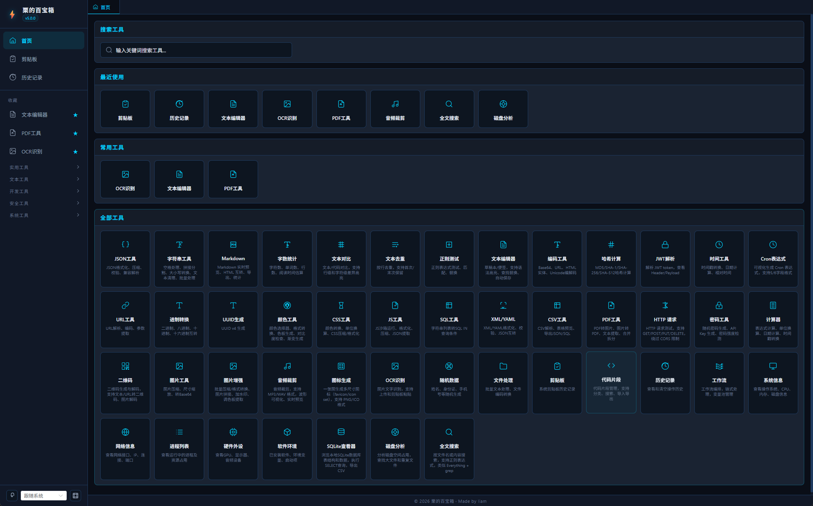

# LitoBox - 栗的百宝箱

<p align="center">
  <strong>零成本 AI 驱动开发的 Windows 桌面工具箱</strong>
</p>

<p align="center">
  <a href="#-功能特性">功能</a> •
  <a href="#-快速开始">快速开始</a> •
  <a href="#-vibe-coding-开发实践">Vibe Coding</a> •
  <a href="#-技术栈">技术栈</a>
</p>

---

## 🖥️ 项目演示

<p align="center">
  
</p>

---

## ✨ 核心特性

- 🚀 **零网络依赖** — 纯离线运行，无需联网
-  **深色/浅色主题** — 自动跟随系统，科技风 UI
- 📦 **便携免安装** — 单 exe 文件，双击即用
- 💾 **数据本地化** — 不上传任何数据，无广告无追踪
- ⚡ **极速响应** — 启动 ≤ 1s，操作 ≤ 100ms
- 🧠 **AI 驱动开发** — 全程零成本，免费模型 + 开源工具链

---

## 🧰 功能特性

### 文本处理

| 工具 | 功能 |
|------|------|
| **JSON工具** | 格式化/压缩/校验/JSON5 兼容解析（支持注释、尾逗号） |
| **字符串工具** | 去空格/大小写转换/文本清理/拼接分割/批量处理 |
| **Markdown** | 实时预览/HTML 互转/导出/统计 |
| **字数统计** | 字符数/单词数/行数/阅读时间估算 |
| **文本对比** | 行级/字符级差异高亮 |
| **文本去重** | 按行去重，支持首次/末次保留 |
| **正则测试** | 正则表达式测试/匹配/替换 |

### 开发工具

| 工具 | 功能 |
|------|------|
| **编码工具** | Base64/URL/HTML实体/Unicode 编解码 |
| **哈希计算** | MD5/SHA-1/SHA-256/SHA-512 |
| **JWT解析** | Token 解码，查看 Header/Payload |
| **时间工具** | 时间戳转换/日期计算/相对时间 |
| **Cron表达式** | 可视化生成/解析，支持5/6字段 |
| **URL工具** | URL 解析/编码/参数提取 |
| **进制转换** | BIN/OCT/DEC/HEX 互转 |
| **UUID生成** | UUID v4 批量生成 |
| **JS工具** | JS 沙箱运行/格式化/压缩 |
| **SQL工具** | 格式化/压缩/校验/JSON转Insert/MyBatis日志解析 |
| **XML/YAML** | 格式化/校验/JSON 互转 |
| **CSV工具** | 解析/表格预览/导出 JSON/SQL |
| **CSS工具** | 颜色转换/单位换算/压缩/格式化 |
| **颜色工具** | 拾色器/格式转换/色板生成/对比度检查/渐变 |

### 安全 & 生成

| 工具 | 功能 |
|------|------|
| **密码工具** | 随机密码生成/API Key 生成/密码强度检测 |
| **二维码** | 生成/解码，支持文本/URL/图片 |
| **随机数据** | 姓名/身份证/手机号等 Mock 数据生成 |

### 文件 & 多媒体

| 工具 | 功能 |
|------|------|
| **文本编辑器** | CodeMirror 6 内核，语法高亮/查找替换/分类管理/自动保存 |
| **OCR识别** | 图片文字提取（支持 PP-OCRv6），支持 PDF 转图后一键识别 |
| **PDF工具** | PDF 转图片/图片转 PDF/文本提取/合并拆分，支持一键跳转 OCR 识别 |
| **图片工具** | 压缩/尺寸缩放/转 Base64 |
| **文件处理** | 批量文本处理/文件编码转换（UTF-8/GBK） |

### 系统工具

| 工具 | 功能 |
|------|------|
| **系统信息** | 操作系统/CPU/内存/磁盘概览，使用率监控 |
| **网络信息** | 网络接口/IP/MAC、活动 TCP 连接、监听端口、WiFi |
| **进程列表** | 运行中进程查看，CPU/内存占用排序，搜索过滤 |
| **硬件外设** | GPU 型号/驱动/显存、显示器分辨率、音频设备 |
| **软件环境** | 已安装软件列表、环境变量、开机启动项 |

### 系统 & 辅助

| 工具 | 功能 |
|------|------|
| **计算器** | 表达式计算/单位换算(11类)/日期计算/时间戳转换 |
| **HTTP请求** | GET/POST/PUT/DELETE，环境变量/收藏/历史，绕过 CORS |
| **代码片段** | 代码片段管理/分类/搜索/导入导出 |
| **剪贴板** | 系统剪贴板历史记录 |
| **历史记录** | 操作历史回溯 |

---

## 🚀 快速开始

### 一键运行

下载 [最新版](../../releases) `litobox.exe`，双击即可运行，无需安装。

### 开发环境

#### 1. 预装工具

| 工具 | 说明 | 安装方式 |
|------|------|----------|
| **Node.js** | >= 16，前端构建环境 | [官网下载](https://nodejs.org/) |
| **Visual Studio Build Tools** | C++ 编译工具链（Tauri/Rust 编译依赖） | 安装时勾选 **"使用 C++ 的桌面开发"** 工作负载 |
| **WebView2** | Windows 11 自带；Windows 10 需[手动安装](https://developer.microsoft.com/microsoft-edge/webview2/) | 系统自带或官网下载 |
| **Git** | 版本控制 | [官网下载](https://git-scm.com/) |

> **重要**: Visual Studio Build Tools 是 Tauri 项目编译的**必须依赖**，缺少会导致 Rust 编译失败。不需要安装完整版 Visual Studio，只需 [Build Tools](https://visualstudio.microsoft.com/visual-cpp-build-tools/) 即可。

#### 2. 安装 Rust

```bash
# 下载并运行 rustup 安装器
# https://rustup.rs/

# 验证安装
rustc --version
cargo --version
```

#### 3. 克隆 & 运行

```bash
git clone https://github.com/libliam/litobox.git
cd litobox
npm install
npm run tauri dev
```

---

## 🧠 Vibe Coding 开发实践

> **本项目是 Vibe Coding 的完整实践案例** — 从需求到上线，全程零手写代码，通过 AI 对话驱动开发。

### 什么是 Vibe Coding？

Vibe Coding 是一种全新的开发范式：**你描述意图，AI 完成编码**。开发者不再纠结于语法细节，而是专注于"要做什么"，让 AI 处理"怎么做"。

本项目证明了：一个完整的桌面应用，从 0 到 1，可以**完全通过对话完成**。

---

### 🔧 开发工具链

| 工具 | 作用 | 费用 |
|------|------|------|
| **[Trae](https://www.trae.ai/)** (CN 版) | AI 原生 IDE，内置 Agent 技能系统 | 免费 |
| **[Qwen](https://qianwen.aliyun.com/)** (通义千问) | 底层 AI 模型，代码生成 & 逻辑推理 | 免费额度 |
| **豆包** | 初版需求文档分析 | 免费 |
| **GitHub** | 版本控制 & 代码托管 | 免费 |

**全程零花费**：每天利用免费额度迭代，额度用完就第二天继续，或多账号交替使用。

---

###  三步开发流程

```
你描述想法 → AI 引导提问 → 确认方案 → 生成设计文档 → 生成实施计划 → AI 自动写代码 → 运行验证
```

#### 第一步：需求确认（`brainstorming`）

在 Trae 中调用 `brainstorming` 技能，用自然语言描述你想加的功能：

> "我想加一个 SQL 格式化工具，能美化 SQL 语句，支持压缩和校验"

AI 会：
- 引导你思考功能边界
- 提供多种技术方案供你选择
- 最终输出**设计文档**到 `docs/superpowers/specs/`

#### 第二步：计划拆解（`writing-plans`）

确认方案后，调用 `writing-plans` 技能：
- AI 将设计文档拆分为**可执行的实施计划**
- 每个任务有明确的输入/输出/验收标准
- 计划文档输出到 `docs/superpowers/plans/`

#### 第三步：自动开发（`subagent-driven-development`）

计划确认后，调用 `subagent-driven-development` 技能：
- AI 按任务分配子代理并行执行
- 每个任务：brief → implement → report 闭环
- 任务间自动审查，快速迭代
- **大多数新功能，一步到位直接搞定**

---

### ️ 经验固化机制（AGENTS.md）

Vibe Coding 不是一次性的对话，而是**持续进化的工程实践**：

| 阶段 | 做法 |
|------|------|
| **踩坑** | 开发中遇到编译错误、样式问题、性能瓶颈 |
| **记录** | 将解决方案写入 `AGENTS.md` |
| **复用** | 下次同类问题，AI 自动参考历史记录 |
| **模板化** | 通用页面结构沉淀为 `_ToolTemplate.vue` |

结果：**越早开发的功能踩的坑越多，越到后面开发越快**，因为经验已经固化到项目记忆中。

---

### 🎯 实际开发成果

| 指标 | 数据 |
|------|------|
| 开发工具 | 100% 免费 |
| 代码手写比例 | ≈ 0%（全部 AI 生成） |
| 开发周期 | 持续迭代，每天推进 |
| 工具数量 | 36+ 个功能工具 |
| 技术栈 | Vue 3 + Tauri 2.0 + TypeScript |

---

### 📚 如何复现

如果你想**用同样的方式开发自己的项目**：

1. **下载 [Trae CN 版](https://www.trae.ai/)** — 免费 AI IDE
2. **配置免费模型** — 选择通义千问或其他免费模型
3. **参考 `AGENTS.md`** — 了解项目规范和开发模式
4. **告诉 AI 你想做什么** — 调用 `brainstorming` 开始

如果你想**为本项目添加新工具**，只需：
1. 在 Trae 中打开项目
2. 告诉 AI："我想加一个 XXX 工具"
3. 跟随引导完成设计 → 计划 → 开发 → 提交 PR

---

## 📐 技术栈

| 层级 | 技术 | 说明 |
|------|------|------|
| 前端 | Vue 3 + TypeScript + Vite | Composition API，类型安全 |
| UI | Element Plus | 桌面端组件库 |
| 桌面 | Tauri 2.0 | Rust 底层，系统级调用 |
| 状态 | Pinia | 轻量状态管理 |
| 存储 | SQLite | 数据持久化，支持导入导出备份 |
| OCR | PaddleOCR.js | PP-OCRv6 离线识别 |
| PDF | pdf-lib + pdfjs-dist | PDF 处理与渲染 |
| 加密 | crypto-js | AES/RSA/DES 等算法 |

---

## 📊 性能指标

| 指标 | 值 |
|------|-----|
| 启动时间 | ≤ 1s |
| 操作响应 | ≤ 100ms |
| 空闲内存 | ≤ 50MB |
| 大文本处理 | 10w 字符无卡顿 |
| 便携版体积 | ≤ 50MB |

---

## 🔒 安全承诺

- ✅ 纯本地离线运行，无网络请求
- ✅ 仅保留必要权限：剪贴板/窗口控制/热键/存储
- ✅ 所有数据本地存储，不上传
- ✅ 无广告、无后台、无数据采集

---

## 🗺️ 版本路线

| 版本 | 状态 | 内容 |
|------|------|------|
| V1.0 | ✅ | JSON/字符串/编码/正则/进制/UUID |
| V1.1 | ✅ | 操作历史/窗口置顶/主题切换 |
| V1.2 | ✅ | SQL/JS执行器/Mock/OCR/文件编码 |
| V1.3 | ✅ | 文本对比工具 |
| V2.x | ✅ | 30+ 工具，OCR/PDF/Markdown/颜色/密码等 |
| V3.0 | ✅ | SQLite 数据持久化、HTTP 环境变量/收藏/历史、快捷键自定义 |
| V3.1 | ✅ | 历史记录增强（完整数据存储、双击跳转恢复、参数还原）、文本编辑器（CodeMirror 6 内核） |
| V3.2 | ✅ | 计算器工具（表达式/单位换算/日期）、PDF↔OCR 工具联动、页面缓存 KeepAlive、编辑器明暗跟随系统 |
| V4.0 | ✅ | 系统工具集（系统信息/网络信息/进程列表/硬件外设/软件环境）、侧边栏固定工具置顶 |

---

##  License

[MIT License](LICENSE)
